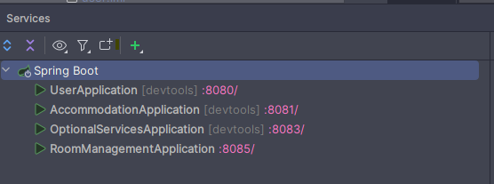
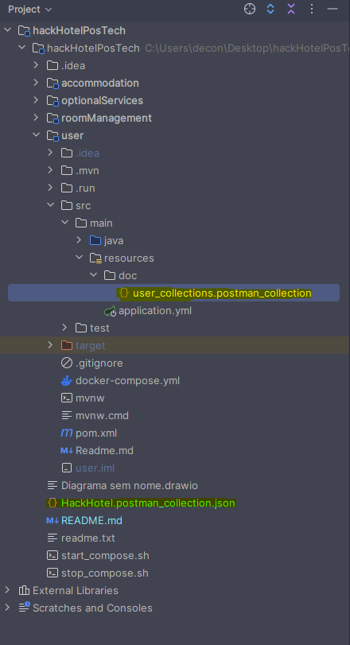

# <h1 align="center">HackaHotel</h1>

Apresentamos o **HackaHotel**, uma inovadora ferramenta que revolucionará a forma como você gerencia seu serviço de
hospedagem bem como seus hóspedes. Com nosso sistema em sua mão, você pode se cadastrar rapidamente, cadastrar suas
localidades, prédios e quartos. Além disto, seus clientes possuem cadastros individualizados para realizarem suas
respectivas reservas, incluindo estadias, serviços e itens de consumo.
Simplifique sua vida, torne-se mais sustentável e economize tempo com nossa ferramenta completa de gestão.

## 📄 Índice

- [Descrição do Projeto](#descrição-do-projeto)
- [Arquitetos Responsáveis](#arquitetos-responsáveis)
- [Funcionalidades](#funcionalidades)
- [Acesso ao Projeto](#acesso-ao-projeto)
- [Execução do Projeto](#execução-do-projeto)
- [Tecnologias utilizadas](#tecnologias-utilizadas)
- [Acesso ao Banco de Dados](#acesso-ao-banco-de-dados)
- [Relatório Técnico](#relatório-técnico)
- [Desafios](#desafios)
- [Documentação Técnica](#documentação-técnica)

## Descrição do Projeto

Este projeto visa criar uma solução abrangente para a gestão eficiente de estabelecimentos de hospedagem e consumo,
proporcionando uma experiência fluida tanto para os proprietários quanto para os clientes. Com um sistema web completo,
o foco principal é oferecer interfaces intuitivas e endpoints para o cadastro e gerenciamento de localidades, prédios,
quartos, clientes, serviços e itens de consumo.

Os benefícios de utilização são múltiplos. Para os proprietários, o sistema oferece uma gestão centralizada e eficiente
de todos os aspectos do seu negócio, desde o cadastro detalhado das instalações até o acompanhamento das reservas e
gastos dos clientes. Isso permite uma melhor tomada de decisões, otimização de recursos e um controle mais preciso sobre
as operações.

Para os clientes, o sistema proporciona uma experiência mais personalizada e conveniente. Eles podem facilmente realizar
reservas, selecionar serviços adicionais e acompanhar seus gastos durante a estadia. Além disso, a integração de
informações sobre as instalações e serviços disponíveis permite uma escolha mais informada e uma experiência mais
satisfatória.

Em resumo, este projeto visa revolucionar a forma como os estabelecimentos de hospedagem e consumo gerenciam seus
negócios e interagem com seus clientes, proporcionando uma plataforma completa e eficiente para atender às suas
necessidades.

## Arquitetos Responsáveis

| [<br><sub>Lucas Mendes</sub>](https://github.com/Luzeraaa) | [<br><sub>Aderson Neto</sub>](https://github.com/avcneto) | [<br><sub>Felipe Chimin</sub>](https://github.com/flpchimin) | [<br><sub>Gustavo Makimori</sub>](https://github.com/gyfmaki) | [<br><sub>Pedro Paratelli</sub>](https://github.com/PedroParatelli) | [<br><sub>Angelo Cavalcanti</sub>](https://github.com/angelocvti) |
| :----------------------------------------------------------------------------------------------------------------------------------: | :---------------------------------------------------------------------------------------------------------------------------------: | :------------------------------------------------------------------------------------------------------------------------------------: | :-------------------------------------------------------------------------------------------------------------------------------------: | :-------------------------------------------------------------------------------------------------------------------------------------------: | :-----------------------------------------------------------------------------------------------------------------------------------------: |


## Funcionalidades

Os endpoints e os dados necessários para consumo da API construída estão disponíveis no [tópico](#documentação-técnica)
abaixo.

Cadastro de usuários/clientes

- Os cadastro serão únicos e criados passando os parametros requisitados.
- Cada usuário terá um ID gerado depois do cadastro o qual será utilizado para relacionar com sua solciitação de reserva.

Cadastro de Localidades, Quartos e Prédios

- Serão cadastrados umas lista de quartos e uma lista de prédios para cada localidade criada.
- O usuário que estiver fazendo a reserva de sua estadia poderá selcionar, a partir de uma lista, a opção de quarto e
prédio de sua preferencia.

Cadastro de Serviços e Itens de consumo

- Serão cadastrados os serviçoes oferecidos pelo estabelecimentp, bem como os itens de consumo que este oferece.
- O usuário poderá, no ato de sua reserva, selecionar os serviços que gostaria de usufruir em sua estadia. 
- O Usuário poderá também comprar itens para consumo próprio, que serão adicionados a sua reserva para pagamento.

Gerenciamento de Reservas (RoomManegement)
- Cada Usuário, acomodação e serviços contratados gerará um Id que será utilizado pelo sitema de gerenciamento para
criar a ordem de reserva. 
- Depois de criada a ordem o sistema de gerenciamento envia um email para o usuário com os dados de sua reserva.
## Acesso ao projeto

Você pode [acessar o código fonte do projeto inicial](https://github.com/Luzeraaa/hackHotelPosTech)
ou [baixá-lo](https://github.com/Luzeraaa/hackHotelPosTech/archive/refs/heads/main.zip).

## Execução do Projeto

1. Fazer o [download](https://github.com/Luzeraaa/hackHotelPosTech/archive/refs/heads/main.zip) do repositorio;

2. Instalar o [Docker](https://www.docker.com/products/docker-desktop/) (Caso esteja em ambiente Windowns instalar WSL);

3. Abrir com a IDE de preferência;

4. Levantar os respectivos bancos de dados, existem 2 maneiras:

    - 1 - Acessar a raiz do projeto e execute o script bash `./start_compose.sh` lembrase que precisamos executar o comandos em algum terminal que interpreta comandos bash. o script é responsavel por executar o banco de dados de todos os micros serviços.
      Para parar todos os bancos de dados utilize o script `./stop_compose.sh`

    - 2 - Acessar as pastas `accommodation`, `optionalServices`, `roomManagement`, `user` e dentro da cada pasta execute o comando `docker-compose up -d` para rodar os bancos de dados isoladamente.

      Observação: Necessario criar o network que será utilizado pelos 4 containers utilizando o comando `docker network create msnetwork` no terminal.

5. Configurar as varíaveis de ambiente para acessar o banco de dados:

    - _DATASOURCE_PASSWORD=fiap_
    - _DATASOURCE_USER=fiap_

6. Executar os 4 projetos.

   

7. Importar a coleção do postman que está localizado no diretorio raiz ``HackHotel.postman_collection.json`` ou acessar os respectivos projetos e importar a coleção de cada micro serviço isoladamente, exemplo: ``/user/doc/user_collections.postman_collection``

8. 

## Acesso ao Banco de Dados

A persistência de dados será realizado através do banco de dados PostgresSQL. Este banco irá rodar em container via Docker.
Maiores detalhes de versão da imagem e configurações de portas verificar arquivo específico de cada microserviço:

- Acomodações: [Docker Compose YML](hackHotelPosTech/accommodation/docker-compose.yml)
- Serviços e Itens: [Docker Compose YML](hackHotelPosTech/accommodation/docker-compose.yml)
- Gerenciamento de Quartos: [Docker Compose YML](hackHotelPosTech/accommodation/docker-compose.yml)
- Usuários: [Docker Compose YML](hackHotelPosTech/accommodation/docker-compose.yml)

## Tecnologias utilizadas

- Java 17 (Versão atualizada e estável da linguagem Java)
- Maven (Ferramenta amplamente adotada para gerenciamento de dependências)
- Spring: Boot, MVC, Data JPA, Web (Frameworks populares para desenvolvimento de aplicativos Java)
- Hibernate (Framework de mapeamento objeto-relacional para acesso a dados)
- JPA (Java Persistence API) (Especificação padrão para persistência de dados em Java)
- Lombok (Biblioteca para reduzir a verbosidade do código e automatizar tarefas comuns)
- Jakarta Bean Validation (Especificação para validação de dados em Java)
- Swagger & OpenAPI (Ferramentas e especificações para projetar, criar e documentar APIs RESTful)
- Docker
- PostgresSQL

<div style="display: inline_block"><br>


</div>

## Relatório Técnico

A arquitetura utilizada neste projeto baseia-se na combinação de conceitos MVC (Model-View-Controller) e DDD (Domain
Driven Design), orientados a microserviços.
Essa combinação permite obter os benefícios de ambos os conceitos, utilizando a arquitetura MVC para a divisão das
responsabilidades de apresentação e controle de fluxo, e o DDD para criar um modelo de domínio encapsulado e rico.

A versão 17 do Java foi escolhida como base para o projeto devido à sua estabilidade e atualização no momento do
desenvolvimento. Para facilitar a configuração e o gerenciamento de dependências, o projeto adotou o Maven, que possui
uma estrutura simples e ampla biblioteca de plugins. Além disso, o Maven possui uma vasta integração com repositórios
centrais e uma
documentação extensa, tornando-o uma escolha popular e confiável para a construção e gerenciamento de projetos Java.

Para de reduzir a verbosidade e os famosos códigos boilerplates do código, além de automatizar a geração de getters,
setters, construtores e outros métodos comuns, o projeto utilizou o Lombok, uma biblioteca para Java.

O Hibernate é amplamente utilizado no desenvolvimento Java devido às suas vantagens significativas. Ele simplifica o
acesso a dados, abstraindo o mapeamento objeto-relacional e automatizando tarefas comuns, aumentando a produtividade dos
desenvolvedores. Além disso, oferece portabilidade, permitindo executar aplicativos em diferentes bancos de dados, e
suporta consultas flexíveis, cache e gerenciamento de transações, proporcionando um ambiente eficiente e robusto para o
desenvolvimento de aplicativos que interagem com bancos de dados relacionais.

Para validar e garantir a integridade dos dados no aplicativo Java, foi utilizado o Jakarta Bean Validation (
anteriormente conhecida como Bean Validation 2.0).
Essa abordagem eficiente permite verificar se os dados inseridos atendem a padrões específicos, como formato de e-mail,
CPF, entre outros. O uso do @Validator com expressões regulares ajuda a manter a consistência dos
dados e reduzir erros ou entradas inválidas, oferecendo uma forma poderosa e flexível de validação de dados no projeto.

Para garantir a persistência de dados, foi implementada uma instância do PostgreSQL em um contêiner Docker,
proporcionando isolamento eficiente de responsabilidades, portabilidade, escalabilidade, facilidade de backup e
segurança, otimizando o desenvolvimento e a manutenção da aplicação.

Os relacionamentos definidos para esta API foram:


## Desafios

- Definir e compreender os relacionamentos.
- Incluir as regras de validações bem como seus regexs.
- Definição da arquitetura do projeto (DDD/MVC/tecnologias e outros).
- Determinação das responsabilidades dos membros da equipe.
- Prazo para execução do hackathon

## Documentação Técnica

---

### Disclaimer

Documentação via SwaggerUI:  
Acommodation: [http://localhost:8081/swagger-ui/index.html#/](http://localhost:8081/swagger-ui/index.html#/)  
Optional Services Collection: [http://localhost:8083/swagger-ui/index.html#/](http://localhost:8083/swagger-ui/index.html#/)  
Room Management Collection: [http://localhost:8085/swagger-ui/index.html#/](http://localhost:8085/swagger-ui/index.html#/)  
User Collection: [http://localhost:8080/api/swagger-ui/index.html#/](http://localhost:8080/api/swagger-ui/index.html#/)

Postman Collection:  
[Acommodation Collection](hackHotelPosTech/optionalServices/src/main/resources/doc/optionalServices.postman_collection.json)  
[Optional Services Collection](hackHotelPosTech/optionalServices/src/main/resources/doc/optionalServices.postman_collection.json)  
[Room Management Collection](hackHotelPosTech/optionalServices/src/main/resources/doc/optionalServices.postman_collection.json)  
[User Collection](hackHotelPosTech/optionalServices/src/main/resources/doc/optionalServices.postman_collection.json)

Postman Documentation:  
[Acommodation Documentation](TBD)  
[Optional Services Documentation](https://documenter.getpostman.com/view/15043957/2sA2xmUqFp)  
[Room Management Documentation](TBD)  
[User Documentation](TBD)

Para as requisições que retornam uma lista com todos os itens é possível parametrizar as propriedades `limit` (número
de limite retornados na consulta) e `offset` (qual página de registros a serem retornados) nos parâmetros da requisição.

## Curl

---
# User

Ping
````
curl --location 'http://localhost:8080/api/ping'
````
Response
````
pong
````


Create User
````
curl --location 'http://localhost:8080/api/user' \
--header 'Content-Type: application/json' \
--data-raw '{
    "name": "John",
    "surname": "Doe",
    "email": "john.doe@text.com",
    "password": "Password&123456",
    "ddd": 11,
    "phone": "1234" ,
    "birthdate": "1990/01/01",
    "address": "123 Main St",
    "country": "BRAZIL",
    "cpf": "123.456.789-01",
    "passport": 987654321
}''
````
Response
````
{
    "id": 5,
    "name": "John",
    "surname": "Doe",
    "email": "john.doe@text.com",
    "ddd": 11,
    "phone": "1234",
    "birthdate": "1990/01/01",
    "address": "123 Main St",
    "country": "BRAZIL",
    "cpf": "123.456.789-01",
    "passport": 987654321
}
````

Get user by param
````
curl --location 'http://localhost:8080/api/user?id=5&cpf=123.456.789-01&email=john.doe%40text.com&limit=10&offset=0'
````
Response
````
{
    "results": [
        {
            "id": 5,
            "name": "John",
            "surname": "Doe",
            "email": "john.doe@text.com",
            "ddd": 11,
            "phone": "1234",
            "birthdate": "1990/01/01",
            "address": "123 Main St",
            "country": "BRAZIL",
            "cpf": "123.456.789-01",
            "passport": 987654321
        }
    ],
    "limit": 10,
    "offset": 0,
    "total": 1
}
````

Update user by id
````
curl --location --request PATCH 'localhost:8080/api/user?id=5' \
--header 'Content-Type: application/json' \
--data '{
    "name": "update name",
    "ddd": "55"
}'
````
Response
````
{
    "id": 5,
    "name": "update name",
    "surname": "Doe",
    "email": "john.doe@text.com",
    "ddd": 55,
    "phone": "1234",
    "birthdate": "1990/01/01",
    "address": "123 Main St",
    "country": "BRAZIL",
    "cpf": "123.456.789-01",
    "passport": 987654321
}
````

Delete by id
````
curl --location --request DELETE 'http://localhost:8080/api/user?id=1'
````
Response
````

````

# Optional Services facility

Register
````
curl --location 'http://localhost:8083/facility' \
--header 'Content-Type: application/json' \
--data '{
    "name" : "Massagem",
    "price" : 100.0
}'
````
Response
````
{
    "id": 2,
    "name": "Massagem",
    "price": 100.0
}
````

Get all facility
````
curl --location 'http://localhost:8083/facility/all'
````
Response
````
{
    "results": [
        {
            "id": 2,
            "name": "Massagem",
            "price": 100.0
        }
    ],
    "limit": 10,
    "offset": 0,
    "total": 1
}
````

get facility by id
````
curl --location 'http://localhost:8083/facility?id=2'
````
Response
````
{
    "id": 2,
    "name": "Massagem",
    "price": 100.0
}
````

Update facility by id
````
curl --location --request PUT 'http://localhost:8083/facility?id=2' \
--header 'Content-Type: application/json' \
--data '{
    "name": "Cafézizinho",
    "price": 111.0
}'
````
Response
````
Facility updated successfully
````

Delete facility by id
````
curl --location --request DELETE 'http://localhost:8083/facility?id=1'
````
Response
````
pong
````

# Optional Services items


Register item
````
curl --location 'http://localhost:8083/items' \
--header 'Content-Type: application/json' \
--data '{
    "name" : "Cafézinho",
    "price" : 10.0
}'
````
Response
````
{
    "id": 2,
    "name": "Cafézinho",
    "price": 10.0
}
````

get all items
````
curl --location 'http://localhost:8083/items/all'
````
Response
````
{
    "results": [
        {
            "id": 2,
            "name": "Cafézinho",
            "price": 10.0
        }
    ],
    "limit": 10,
    "offset": 0,
    "total": 1
}
````

Update item by id
````
curl --location --request PUT 'http://localhost:8083/items?id=2' \
--header 'Content-Type: application/json' \
--data '{
    "name": "Cafézizinho",
    "price": 111.0
}'
````
Response
````
Items updated successfully
````

Delete by id
````
curl --location --request DELETE 'http://localhost:8083/items?id=1'
````
Response
````
````

# Accommodation location

register location
````
curl --location 'http://localhost:8081/locations' \
--header 'Content-Type: application/json' \
--data '{
    "name": "Paradise City 2",
    "address": {
        "zipCode": "01542-212",
        "street": "Rua Coronel",
        "number": 550,
        "neighborhood": "Cambuci",
        "city": "São Paulo",
        "state": "DF",
        "reference": "Next to UBS"
    }
}'
````
Response
````
{
    "id": 3,
    "name": "Paradise City 2",
    "address": {
        "zipCode": "01542-212",
        "street": "Rua Coronel",
        "number": 550,
        "neighborhood": "Cambuci",
        "city": "São Paulo",
        "state": "DF",
        "reference": "Next to UBS"
    },
    "amenities": null,
    "buildings": null
}
````


